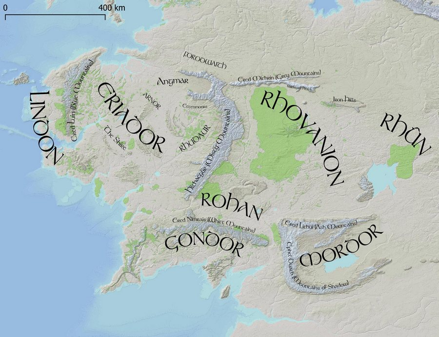
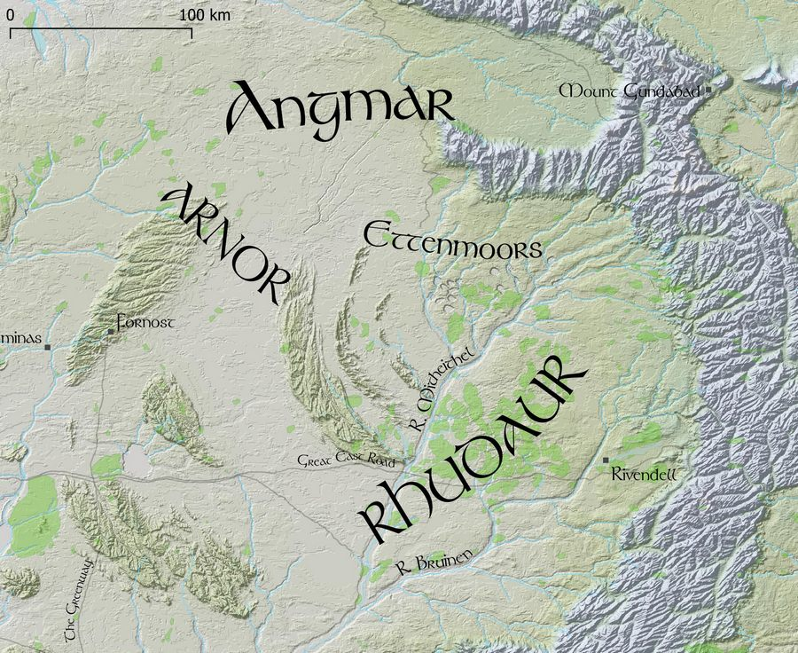
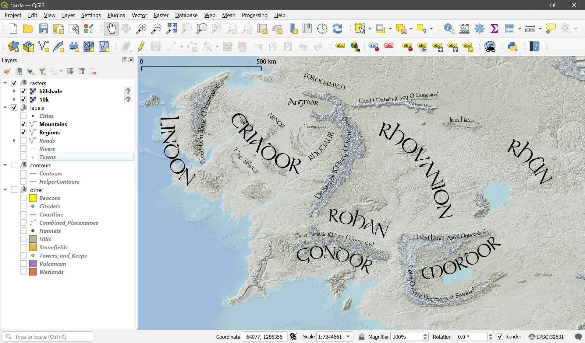
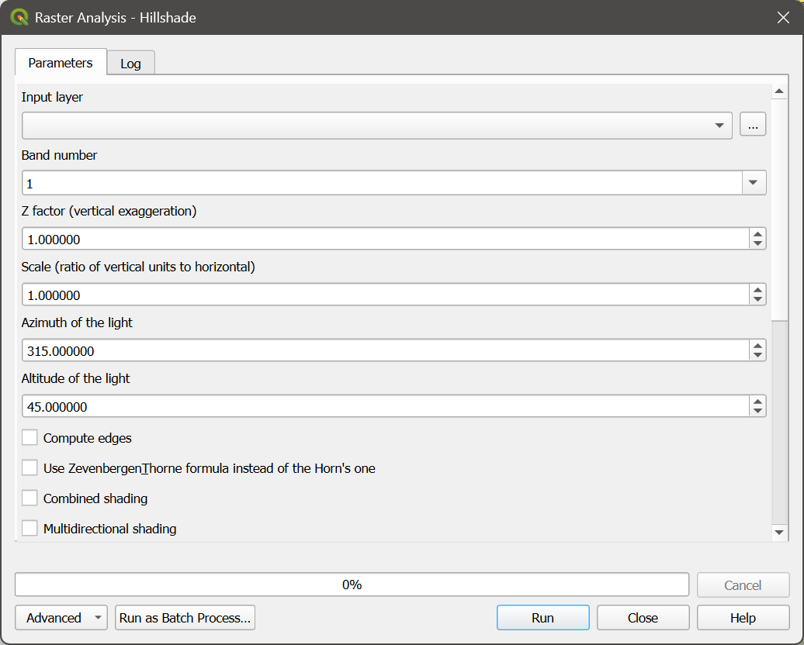

# Arda

Maps of J. R. R. Tolkien's Middle Earth, using a DEM (Digital Elevation Model), which is a 10k x 10k pixel black and white jpeg image, and place name vectors.

[Arda](https://en.wikipedia.org/wiki/Arda_(Tolkien)) was the name of the entire world, which included the part known as Middle Earth. 

## Goals

- Make colored elevation maps with hillshading
- Make name placement and size similar to Tolkien's maps
- Use as detailed maps for Adventures in Middle Earth (D&D 5e) games

## History

Some users on the [Outerra Worlds Forum](http://worlds.outercraft.com/forum/index.php) created the original project, called ME-DEM. 

monks and Redrobes created the DEM using real-world 3d elevation data, hand-editing, and simulated erosion. 

monks, SeerBlue, and Redrobes created the place names. 

jvangeld took over project maintenance.

bburns made the project Arda - added curved Tolkienesque labels, colored the different elevations, and added a hillshade layer.

andewheiss took over project maintenance for the old vector layers - https://github.com/andrewheiss/ME-GIS - so these need to be merged...

## Data

The folder 'data' includes:

- arda.qgs - the XML project file for QGIS - it describes where to find the elevation, vector, and hillshade layers, and how to color the map.

- elevation 
  - 10k.jpg - black and white jpg DEM file with 10k x 10k pixels. The entire map covers 2000km on each side, so the resolution is 200m/pixel. 
  - 10k.wld - defines how the DEM corresponds to the map coordinate system as used by the vector data. This is currently slightly off - improvements could be made. 

- hillshade - includes the hillshade image rendered from the elevation data.

- vector - includes layers for place names, rivers, forests, and mountains.

## Resolution

The entire map covers 2000km on each axis, so the resolution of the 10k x 10k DEM is 200m/pixel. Somewhere there is also a 40k x 40k DEM version with 50m/pixel resolution.

## Font

The font is Tolkien, originally from https://fontzone.net/font-details/tolkien. 

## Installing

Clone this repo

    git clone https://github.com/bburns/Arda.git
    cd Arda

Install the Tolkien font (fonts/Tolkien.ttf) in your system - eg in Windows, right click on the file and say Install. 

Install [QGIS](https://qgis.org/)

Open [data/arda.qgs](./data/arda.qgs) in QGIS

You can turn different layers on and off, adjust opacity, change the map colors, add labels, etc.

## Building

If you change the DEM and need to rebuild the hillshade layer - **Raster / Analysis / Hillshade** - enter a Z factor (vertical exaggeration) of 100.0 and click Run. Then adjust the global opacity of the resulting layer to 50% - **Layer Styling sidebar / Transparency / Global Opacity**. This allows the underlying colored map to show through. 

## Todo

- Add river sizes in meters and render widths accordingly
- Make map views for the Hobbit (overview, The Shire, Eriador, Misty Mountains, Mirkwood)
- Make map views for The Lord of the Rings corresponding to travels
- Explain QGIS and pull requests for shapefile data in readme
- Switch easily between colorful and minimal color versions - how do?
- Get access to 40k x 40k DEM (50m/px) version
- Render to tiles for Google Maps-like site, using Leaflet - try vector map tiles and mapboxGL? include search index

## License

This project is MIT, though the 3d DEM elevation data (10k.jpg) and vector layers are uncertain.
