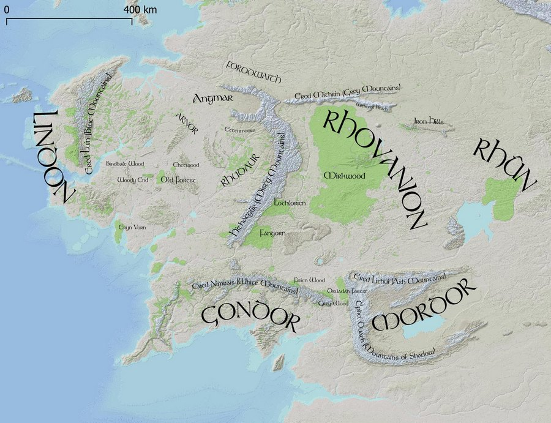
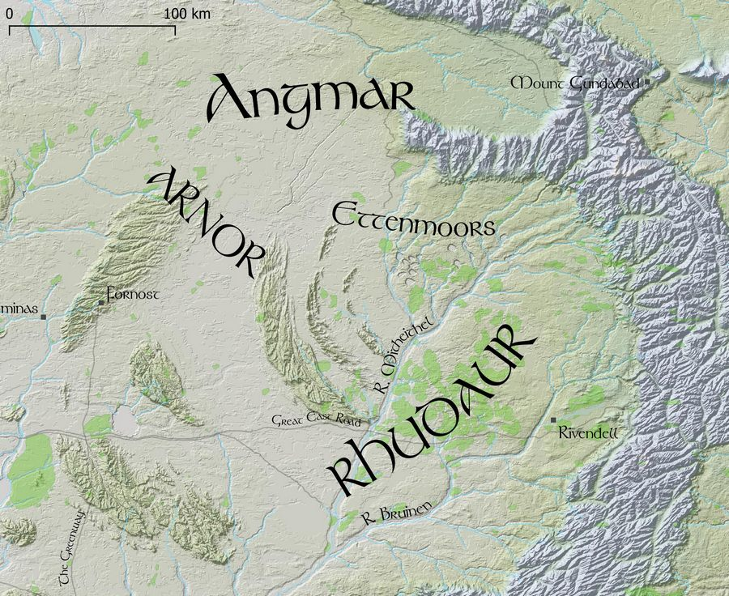

# Arda

Maps of J. R. R. Tolkien's Middle Earth, using a DEM (Digital Elevation Model), which is a 10k x 10k pixel black and white jpeg image, and place name vectors.

[Arda](https://en.wikipedia.org/wiki/Arda_(Tolkien)) was the name of the entire world, which included the part known as Middle Earth. 

## Goals

- Make colored elevation maps with hillshading
- Make name placement and size similar to Tolkien's maps
- Use as detailed maps for Adventures in Middle Earth (D&D 5e) games

## Data

The elevation data is in a 10k x 10k black and white jpg DEM file (data/elevation/10k.jpg), made by monks and Redrobes on the [Outerra Worlds Forum](http://worlds.outercraft.com/forum/index.php). The process included some real-world 3d elevation data, hand-editing, and simulated erosion. Somewhere they also have a 40k x 40k DEM (50m/px) version. 

The vector data (data/vector) includes place names, rivers, forests, mountains - made by monks, SeerBlue, and Redrobes, and maintained here - https://github.com/andrewheiss/ME-GIS. bburns added curved Tolkienesque labels, colored the different elevations, and added a hillshade layer.

The file arda.qgs is the XML project file for QGIS - it describes where to find the vector layers, how to produce the hill shading, and how to color the map.

The entire map covers 2000km on each axis, so the resolution of the DEM is 200m/px. The file `data/elevation/10K.wld` defines how the DEM corresponds to the map coordinate system as used by the vector data. This is currently slightly off - improvements could be made. 

The font is Tolkien, originally from https://fontzone.net/font-details/tolkien. 

## Installing

Clone this repo

    git clone https://github.com/bburns/Arda.git
    cd Arda

Install the Tolkien font (fonts/Tolkien.ttf) in your system. 

Install [QGIS](https://qgis.org/)

Open [data/arda.qgs](./data/arda.qgs) in QGIS

Build the hillshade layer - **Raster / Analysis / Hillshade** - enter a Z factor (vertical exaggeration) of 100.0 and click Run. This will be stored in a ~100MB TIFF file (data/hillshade/hillshade.tif), and is not included in this repo. 

Then adjust the global opacity of this layer to 50% - **Layer Styling sidebar / Transparency / Global Opacity**. 

This allows the underlying colored map to show through. 

## Todo

- Add river sizes in meters and render widths accordingly
- Make map views for the Hobbit (overview, The Shire, Eriador, Misty Mountains, Mirkwood)
- Make map views for The Lord of the Rings corresponding to travels
- Explain QGIS and pull requests for shapefile data in readme
- Switch easily between colorful and minimal color versions - how do?
- Get access to 40k x 40k DEM (50m/px) version
- Render to tiles for Google Maps-like site, using Leaflet - try vector map tiles and mapboxGL? include search index

## License

This project is MIT, though the 3d DEM elevation data (10k.jpg) is uncertain.
